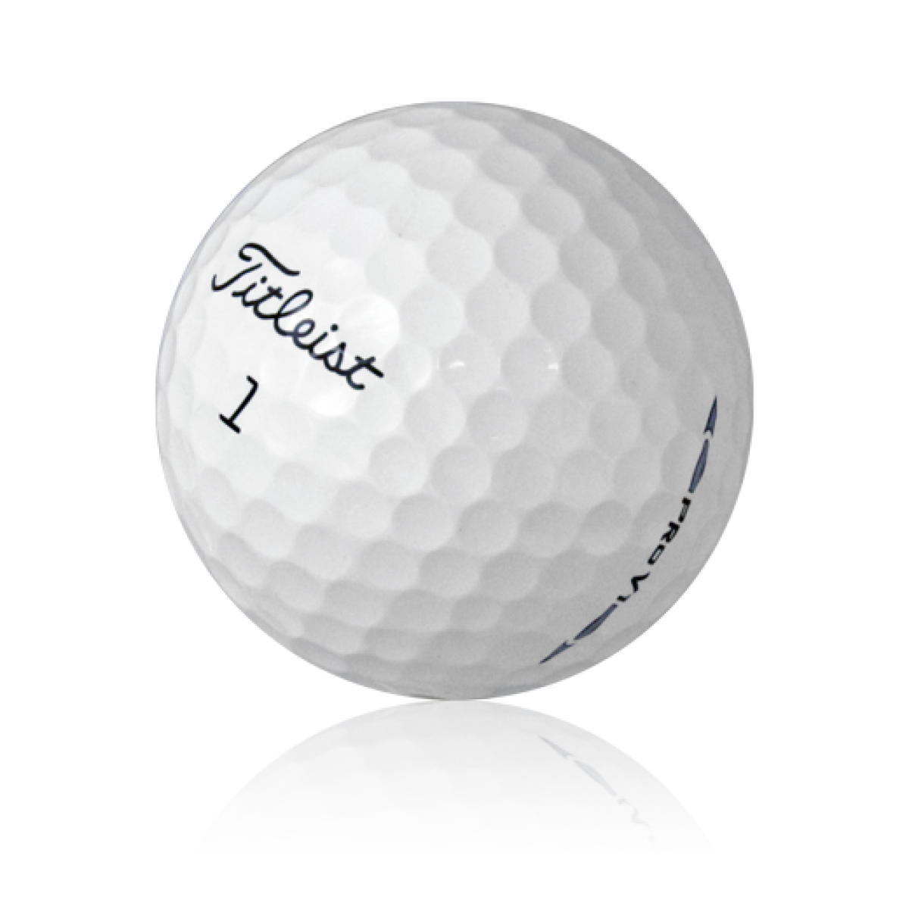

    Lorem ipsum

<h1>Titel</h1>

Henrik Ekelöf

Allmänt

## Betting



Spelformer
Fyra spelare

Wolf (4 spelare)
Wolf är en individuell spelform där man till och från är med i olika två- eller tremannalag. Spelas bäst utan HCP, annars med reducering till 80%.
En spelare är "wolf" på varje hål. Bestäm i förväg vilken ordning, förslagsvis högt-till-lågt HCP, lottning eller jämn fördelning av par 3 och 5. På hål 17-18 är den med lägst poäng wolf.
Wolf slår alltid ut sist.
Innan någon spelare slagit ut kan wolf Före alla

Wolf
3 spelare
Poäng delas ut för varje hål, en ensam spelare mot ett lags bästboll.
En spelare är Wolf på varje hål. Man turas om i HCP-ordning högst-lägst på hål 1-15.
Hål 16-18 gäller att lägst totalscore är Wolf (räknas om på varje hål).
Wolf slår alltid ut sist.
Valmöjligheter för Wolf
Innan någon spelare slagit ut kan Wolf välja att bli Blind Wolf för möjlighet till maximal poäng.
Efter en annan spelares utslag kan Wolf välja att skapa ett team med denne. Måste göras innan nästa spelare slår ut. Wolf kan välja att inte skapa ett team utan istället bli Lone Wolf för att öka poängmöjlighet.
Poäng
Normal Wolf (Wolf har valt ett team)
4 poäng (2 till varje i Wolf-team eller 4 till den ensamme)
Lone Wolf (Wolf ser de andras utslag och väljer att spela ensam)
6 poäng (3 till varje spelare i teamet eller 6 till Wolf)
Blind Wolf (Wolf väljer att spela ensam innan de andra slagit ut)
8 poäng (4 till varje spelare i teamet eller 8 till Wolf)

Umbriago (Scotch, Twist)
Spelas utan HCP, bäst om alla spelare är ganska jämna. Sätt ihop två par. Antingen de med högst + lägst HCP eller genom lottning.
På varje hål delas poäng ut enligt nedan:
1p Närmast hål
1p Bäst score individuellt
1p Bäst totalscore för laget
Extrapoäng:
1p Umbriago (alla tre grundpoängen)
1p Birdie
2p Eagle

Choose partners
Same partners for 18 holes
Six point game
Two points for low ball
Two points for low total
One point for natural birdie
One point for proximity
Umbrella Rule if all six points are achieved doubles to 12 points 
Walker Rule if two natural birdies are achieved 12 points go to 24 (or points soon is doubled)
$ amount from .10c to $100.00
Typically $1.00 to $3.00 a point
Losing team can Twist or double the bets for 1 hole. The winning team tees off first every time to allow the team behind to "TWIST" after they see the tee shots of their opponents. If their tee balls rant great and or you or your teammate gets a shot you can twist them after they hit but before you hit your first shots. Doubles the bets for one hole.
4 spelare / 2-mannalag
Poängen delas ut efter varje hål:
1p Närmast hål på rätt antal slag.
1p Bästa individuella resultat.
1p Bästa lagresultat (summan).
Bonusar:
+1p Om man vinner alla tre poängen ovan (Umbriago = 4p).
x2 Om man vinner alla tre och har en birdie (8p).
x4 Om man vinner alla tre och har två birdies (16p).
Alternativ:
– + 1p för en birdie
– x2 för att vinna alla tre med dubbel birdie (8p)

Köpenhamnare (Split Sixes, English, Cricket)
Matchspel för tre spelare. Använd 80% av erhållna slag vid HCP-spel.
Sex poäng delas ut på varje hål
4-2-0 då alla har olika score
4-1-1 för ensam vinnare och delad tvåa
3-3-0 delad vinst för två spelare
2-2-2 alla lika
Treboll match
Individuella matcher spelas mellan alla spelare vilket innebär att varje spelare spelar två matcher samtidigt.
Normala regler för matchspel gäller. Om en situation uppstår där regler för en match hamnar i konflikt med en annan måste båda hanteras. Exempel: Spelare A skänker Spelare B:s putt. Spelare C vill inte skänka putten. För matchen A-B är då putten skänkt men B måste ändå putta. Eventuell miss påverkar då endast matchen A-C men inte A-B.
Regel 21.4. Treboll matchspel är en form av matchspel där var och en av tre spelare spelar en individuell match mot de andra två spelarna på samma gång. Varje spelare spelar en boll som används i båda matcherna.
De normala reglerna för matchspel i Regel 1–20 gäller för alla tre individuella matcher, utom att dessa specifika regler gäller i två situationer, där en tillämpning av de normala reglerna i en match kan komma i strid med tillämpningen av dem i annan match.

Vegas
Spelas i tvåmannalag, helst utan HCP. Om HCP används skall det reduceras till 50%.
Scoren på ett hål är lagets resultat adderat siffervis. Om laget har minst ett par eller bättre sätts den lägsta siffran först, om ingen gör par sätts den högsta siffran först.
Par 4, score 3 och 4 ger 34 poäng.
Par 4, score 5 och 7 ger 75 poäng.
Lägst poäng vinner.
Flip the bird
https://theleftrough.com/top-10-golf-gambling-games/
Bäst/sämst match (90% hcp avrundat på antal slag, sätt lägst på 0)
Bingo-Bango
6.&nbsp;Bingo, Bango, Bongo!</h3>

This is an imaginative game that is great for allowing weaker players and even beginners an opportunity to take points and dollars from more experienced competitors.

Points are scored on each hole as follows:

<strong><em>Bingo</em></strong>&nbsp;– the first player to hit the green, whether in regulation or not

<strong><em>Bango</em></strong>&nbsp;– the player closest to the pin after all balls are on the green

<strong><em>Bongo</em></strong>&nbsp;– the first player to get the ball into the cup

With so many point-scoring opportunities, the game can generate considerable enthusiasm. But more introverted players should be reassured that it is not necessary, or at more exclusive clubs even permissible, to shout out the words themselves.

The great thing about this game is that the total score on a hole is irrelevant to the winning of points. This helps players with a weaker tee to the green game can still compete.

Even if they take two or more shots over-regulation to get to the green, it doesn’t matter. If their final shot to the green is just a short chip shot, they may still have a good chance of being closest to the pin and scoring Bango. Likewise, any player may from time to time see a longish putt drop in and score Bongo.

For this reason, the game is a popular choice for association and society days, but it can also be played alongside more conventional stroke and match play formats if desired.

OOB-regel
Pluggad boll
Slaggolf
Spelformer
Puttning

Rotella´s Putting game
En tävlingsform för två eller flera spelare.
Välj ett hål ca 5-10 meter bort. Alla puttar en putt. Hålad putt ger +2p. Närmast hål om ingen sänker ger +1p och man får ta upp bollen.
Spelare som inte sänkt eller kommit närmast hål kan välja att stå över nästa putt och får då -1p. Annars måste man slå putten och får då 0p för sänkt putt eller -2p för en missad putt.

100-foot drill
En tävlingsform för en eller flera spelare.
Placera ut fyra bollar på 5, 10, 15 och 20 fot (1,5, 3, 4,5 och 6 meter). Varje sänkt putt ger 5-20 poäng beroende på avstånd.
Gör totalt fem omgångar. Använd olika hål eller putta från olika riktningar.
Efter fem omgångar har du puttat totalt 250 fot. Målsättningen skall vara att få minst 100 poäng om du spelar ensam.
